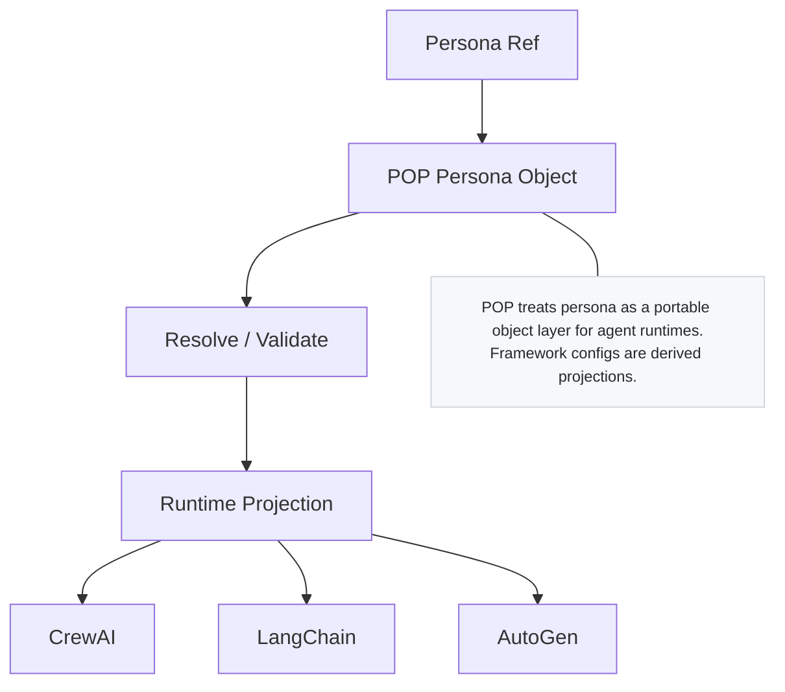

<!-- language-switch:start -->
[English](./README.md) | [中文](./README.zh-CN.md)
<!-- language-switch:end -->

# 角色对象协议 (POP)

[](https://github.com/joy7758/persona-object-protocol/actions/workflows/validate.yml)
[](https://pypi.org/project/pop-persona/)
[](https://pypi.org/project/pop-persona/)
[](https://doi.org/10.5281/zenodo.18907957)
[](https://github.com/joy7758/persona-object-protocol/releases)
[](./LICENSE)

用于数字生物圈架构的便携式角色对象层。

## 角色

`persona-object-protocol` 是数字生物圈架构的角色层。它定义了跨运行时的可移植角色对象、投影规则和角色附件表面。

## 不是这个仓库

- 不是治理层
- 不是审计层
- 不是基准套件
- 不是架构总仓

## 从这里开始

- [TRY_POP.md](TRY_POP.md)
- [文档/cite-pop.md](docs/cite-pop.md)
- [数字生物圈架构](https://github.com/joy7758/digital-biosphere-architecture)

## 取决于

- [数字生物圈架构](https://github.com/joy7758/digital-biosphere-architecture)
- [智能体意图协议](https://github.com/joy7758/agent-intent-protocol)
- 可选的运行时集成，例如 LangChain 和 CrewAI

## 地位

- 活跃角色层
- 协议优先表面
- 运行时集成仍然次要于规范 POP 模型

## 在数字生物圈架构中的作用

POP 是 **Persona 对象标准条目**。

它定义了自主代理使用的角色对象的规范结构。

在建筑学中的地位：

角色层 -> POP

## 多模式人工智能系统中可移植角色对象的轻量级草案协议

POP是[数字生物圈架构](https://github.com/joy7758/digital-biosphere-architecture)的角色层。它专注于更广泛架构的一层，而不是完整的代理堆栈。 POP 是一种与框架无关的角色对象协议，构建为具有明确边界的可移植角色对象的可重用接口和投影模型。

它是定位优先且面向协议的：不是产品，不是角色生成管道，也不是完整的运行时堆栈。

POP 的首选学术引用是 POP-Core 论文：[10.5281/zenodo.18907957](https://doi.org/10.5281/zenodo.18907957)。

该仓库本身单独存档在 Zenodo 上，地址为 [10.5281/zenodo.18898252](https://doi.org/10.5281/zenodo.18898252)，以供特定版本的软件引用。

有关最低限度的引用指南，请参阅 [`docs/cite-pop.md`](docs/cite-pop.md)。

## 架构背景

该仓库是[数字生物圈架构](https://github.com/joy7758/digital-biosphere-architecture)生态系统中的重点层。
它并不试图成为完整的堆栈。
它为可验证的人工智能系统提供了角色层。
它的重点是可移植的角色对象、可重复使用的投影表面以及跨运行时的身份附加。

## 与相邻仓库的关系

POP 是更广泛堆栈中的角色层接口和投影模型。它不是完整的架构，不是审计层，也不是通用的端到端演示。对于系统视图，从 [digital-biosphere-architecture](https://github.com/joy7758/digital-biosphere-architecture) 开始；对于演练路径，请参阅[可验证代理演示](https://github.com/joy7758/verifiable-agent-demo)；有关结构化代理对象的相邻较低层协议工作，请参阅 [代理对象协议](https://github.com/joy7758/agent-object-protocol)。

## 一审

想要在不设置完整运行时的情况下快速尝试 POP？
从这里开始：

- [3分钟尝试POP](TRY_POP.md)

这个试运行演示展示了 3 个便携式角色对象投影到 3 个
CrewAI 风格的运行时角色。

## 插件发现

演示工作流程可以从内置模块加载注册表扩展，
外部插件包。默认情况下，运行时会查找本地
仓库根目录中的 `plugin_config.json` 文件（如果存在）。一个例子
模板可在 [`plugin_config.example.json`](plugin_config.example.json) 获取，
配置形状定义为
[`plugin_config.schema.json`](plugin_config.schema.json)。第二个例子，
[`plugin_config.packages.example.json`](plugin_config.packages.example.json),
显示包名称和包搜索路径单独列出的变体。
示例配置也在 CI 中进行了验证，因此在 PR 审查期间可以捕获架构漂移。

对于临时覆盖，您还可以将发现指向外部插件
封装 `POP_PLUGIN_CONFIG_FILE`、`POP_PLUGIN_PACKAGES` 和
`POP_PLUGIN_PACKAGE_PATHS`。

如果您在此仓库之外使用基于文件的插件配置验证，
安装可选的架构依赖项：

```bash
pip install "pop-persona[schema]"
```

### 插件扩展教程

演示注册表从三个扩展表面加载定义：

- `STAGE_HANDLER_DEFINITIONS` 用于舞台处理器
- `PERSONA_DEFINITIONS` 用于内置或外部角色注册表项
- `TASK_TYPE_DEFINITIONS` 用于任务类型元数据和阶段路由

发现顺序是：

1. 内置`demos`模块
2. `plugin_config.json` 或 `POP_PLUGIN_CONFIG_FILE` 的封装
3. `POP_PLUGIN_PACKAGES` 和 `POP_PLUGIN_PACKAGE_PATHS` 中的软件包名称和搜索路径

环境变量充当基于文件的配置之上的覆盖层。

#### 配置形状 1：`plugin_paths`

当每个插件包最容易描述为单个时使用此选项
`path` 加 `package_name` 一对。

```json
{
  "$schema": "./plugin_config.schema.json",
  "plugin_paths": [
    {
      "path": "/tmp/pop_demo_plugins",
      "package_name": "pop_demo_plugins"
    }
  ],
  "plugin_packages": [],
  "plugin_package_paths": []
}
```

这是图中所示的形状
[`plugin_config.example.json`](plugin_config.example.json)。

#### 配置形状 2：`plugin_packages` + `plugin_package_paths`

当需要管理包名称和导入搜索路径时使用此选项
分别地。

```json
{
  "$schema": "./plugin_config.schema.json",
  "plugin_paths": [],
  "plugin_packages": [
    "pop_demo_plugins",
    "pop_extra_plugins"
  ],
  "plugin_package_paths": [
    "./plugins/pop_demo_plugins",
    "./plugins/pop_extra_plugins"
  ]
}
```

这是图中所示的形状
[`plugin_config.packages.example.json`](plugin_config.packages.example.json)。

#### 现场笔记

- `plugin_paths`：纯路径字符串或带有 `path` 和可选 `package_name` 的对象的数组。
- `plugin_packages`：导入包名称以扫描 `*_DEFINITIONS` 导出。
- `plugin_package_paths`：在插件包导入之前添加到 `sys.path` 的文件系统路径。
- `path`：从配置文件目录解析出相对路径；绝对路径按原样使用。
- `package_name`：对于 `plugin_paths` 条目是可选的，但如果仅路径不足以识别要导入的包，则需要。

#### 如何添加插件包

1. 创建一个公开以下一项或多项的 Python 包：
`STAGE_HANDLER_DEFINITIONS`、`PERSONA_DEFINITIONS`、`TASK_TYPE_DEFINITIONS`。
2. 如果角色定义指向 JSON 文件，请将 JSON 保留在
插件包并在`PersonaDefinition`上设置`package_name`，这样
运行时可以正确解析相对文件路径。
3. 将包添加到 `plugin_config.json`，或将运行时指向它
`POP_PLUGIN_CONFIG_FILE`、`POP_PLUGIN_PACKAGES` 和 `POP_PLUGIN_PACKAGE_PATHS`。
4. 针对引用新 `task_type` 的任务运行演示。

例子：

```bash
POP_PLUGIN_CONFIG_FILE=/tmp/pop_demo_plugins/plugin_config.json \
python demos/persona_workflow_demo.py --task-input /tmp/content_strategy_task.json
```

## 角色层图



静态资源：[SVG](docs/assets/pop-persona-layer-diagram.svg) · [PNG](docs/assets/pop-persona-layer-diagram.png)

## 设计定位

POP 为智能体运行时定义了一个可移植的角色对象层。

该协议侧重于将角色表示为一个独立的对象，可以引用、解析、验证并投影到不同的运行时环境中。

运行时配置（例如 CrewAI 代理或其他特定于框架的配置）是派生投影，而不是协议核心。

这种分离使角色定义可以跨代理框架移植，而运行时环境仍然可以自由地实现自己的执行模型。

## 定位

- POP 不是一个完整的代理框架。
- POP不是提示模板库。
- POP 不是内存或权限系统。
- POP 没有定义任务意图对象。
- POP 没有定义动作交换对象。
- POP 没有定义结果交换对象。
- POP 专注于可移植角色对象和基于适配器的运行时投影。

## 与交互层的关系

POP 定义了代理是谁。
交互层定义正在请求或尝试的内容。
这种分离使身份与任务语义不同。

对于更广泛的生态系统中的交互层草案，请参阅[Agent Intent Protocol](https://github.com/joy7758/agent-intent-protocol)。

## 生态系统方向

- 浪链整合
- CrewAI 投影
- Microsoft Agent 框架探索
- LlamaIndex 探索

当前生态系统规划请参见[`docs/pop-ecosystem-roadmap.md`](docs/pop-ecosystem-roadmap.md)。
适配器策略请参见[`docs/pop-adapter-model.md`](docs/pop-adapter-model.md)。

## 运行时适配器层

面向运行时的适配器表面记录在
[`docs/runtime-adapters.md`](docs/runtime-adapters.md)。目前的
LangChain 和 CrewAI 适配器是早期预览的支架，可绑定
规范 POP 角色对象到面向运行时的表示
无需更改架构基线。

## 运行时集成（早期预览版）

LangChain集成脚手架可通过可选的
`langchain` extra和CrewAI集成脚手架可用
通过可选的 `crewai` 额外。规范模式基线
仍然是 `v0.1.0`，而面向运行时的绑定表面继续
发展。

安装示例：

```bash
pip install "pop-persona[langchain]"
pip install "pop-persona[crewai]"
```

示例脚本：

- [`examples/integrations/langchain_minimal.py`](examples/integrations/langchain_minimal.py)
- [`examples/integrations/crewai_minimal.py`](examples/integrations/crewai_minimal.py)

## POP → CrewAI 原型

该仓库包括早期的 POP → CrewAI 适配器原型。

目前的能力：

- 从 JSON 加载 POP 角色
- 将 POP 角色转换为与 CrewAI 兼容的代理配置
- 从 POP 角色对象导出 CrewAI YAML

角色文件示例：

- `personas/marketing_manager.json`
- `personas/engineer.json`
- `personas/designer.json`

生成的示例：

- `personas/marketing_manager.crewai.yaml`

示例脚本：

- `example_crewai.py`
- `example_crewai_export.py`

当前范围：

- 本地角色加载
- CrewAI 配置生成
- 用于 CrewAI 风格配置的 YAML 导出

这是一个早期的适配器原型，旨在展示 POP 作为一种
代理框架角色层。

### CrewAI YAML 导出

POP 角色还可以导出为 CrewAI 风格的多智能体 YAML
配置。

例子：

- `example_crewai_multiagent_export.py`
- 生成的文件：`personas/agents.crewai.yaml`

这使得 POP 不仅可用于直接代理构建，还可以用于
适用于 CrewAI 推荐的基于 YAML 的配置流程。

### CrewAI 推荐的 YAML 流程

CrewAI 文档建议使用 YAML 配置来定义智能体。
POP 现在可以导出适合此路径的多智能体 YAML。

演示文件：

- `examples/crewai_config_demo/config/agents.yaml`
- `examples/crewai_config_demo/crew_example.py`

这表明：

POP 角色 -> CrewAI 风格 `agents.yaml` -> 基于配置的代理
建造

### CrewAI CrewBase 式演示

CrewAI 文档建议基于 YAML 的代理配置，其中
YAML 键与 Python 代码中的方法名称匹配。

该仓库现在包含一个 POP 驱动的 CrewBase 风格的演示：

- `examples/crewai_crewbase_demo/config/agents.yaml`
- `examples/crewai_crewbase_demo/crew_demo.py`

这表明：

POP 角色 -> CrewAI 风格 `agents.yaml` -> 方法一致
CrewBase 风格的 Python 结构

### AutoGen 对齐原型

该仓库包括早期的 POP -> AutoGen 适配器原型
与当前 AutoGen 快速入门形状对齐：

- `AssistantAgent`
- `model_client`
- `tools`
- `system_message`

例子：

- `example_autogen.py`

目前的能力：

- 将 POP 角色映射到 AutoGen 风格的配置中
- 从角色对象生成 `system_message`
- 如果未安装 AutoGen，则返回安全预览对象
- 对于真正的 `AssistantAgent` 需要显式的 `model_client`
建造

推荐的 AutoGen 安装（上游样式）：

```bash
pip install -U "autogen-agentchat" "autogen-ext[openai,azure]"
```

## POP 智能体运行时配置文件

该仓库现在区分：

- POP 规范角色对象（协议层对象）
- POP 智能体运行时配置文件（面向框架的运行时绑定）

当前的 `personas/*.json` 示例被视为智能体运行时
CrewAI 和 AutoGen 等代理框架的配置文件。

相关文件：

- `spec/POP-agent-runtime-profile.md`
- `schema/profiles/pop-agent-runtime-profile.schema.json`

## POP 注册表/SDK 原型

该仓库包括早期的本地注册表/SDK 原型
角色对象。

目前的能力：

- `list_personas()` 枚举本地角色文件
- `list_persona_ids()` 枚举本地角色 ID
- `resolve_persona(persona_ref)` 将角色引用映射到文件
- `load_persona_by_id(...)` 通过注册表加载角色
- `validate_persona(...)` 执行最少的验证

例子：

- `example_registry.py`

### 角色 ID/URI 约定（原型）

POP 注册表原型现在支持规范化的角色引用。

示例：

- `marketing_manager_v1`
- `pop:marketing_manager_v1`

这是基于 POP 的稳定角色标识符的早期原型
工具。当前的实现标准化了 `pop:<persona_id>`
参考本地注册表决议，为未来做好准备
基于 URI 的注册表演变。

## 执行层助手（早期预览版）

LangChain执行助手可通过可选的运行时使用
集成界面和 CrewAI 执行助手可用
通过可选的运行时集成表面。规范模式
基线仍然是 `v0.1.0`。

执行层示例：

- [`examples/integrations/langchain_create_agent_minimal.py`](examples/integrations/langchain_create_agent_minimal.py)
- [`examples/integrations/langchain_execution_minimal.py`](examples/integrations/langchain_execution_minimal.py)
- [`examples/integrations/crewai_execution_minimal.py`](examples/integrations/crewai_execution_minimal.py)

## 浪链执行合约（早期预览版）

LangChain 执行助手可通过可选的
`langchain` 额外。它们与 LangChain v1 保持一致
`create_agent`、中间件和运行时上下文帮助程序表面，但是
它们不是官方的 LangChain 运行时对象。规范模式
基线仍然是 `v0.1.0`。

该版本中面向LangChain的主要入口点是
`create_langchain_execution_bundle(...)`。可选 `langchain` 支持
启用更丰富的帮助程序/规范路径，同时保留兼容性帮助程序
可用但不再是主要记录路径。

浪链合约示例：

- [`examples/integrations/langchain_create_agent_minimal.py`](examples/integrations/langchain_create_agent_minimal.py)
- [`examples/integrations/langchain_execution_minimal.py`](examples/integrations/langchain_execution_minimal.py)
- [`examples/integrations/langchain_installed_contract_minimal.py`](examples/integrations/langchain_installed_contract_minimal.py)

早期执行脚手架系列的兼容性助手是
保留是为了向后兼容。主要面向LangChain
当前发布线的表面是：

- `create_langchain_execution_bundle(...)`
- `create_langchain_create_agent_kwargs(...)`
- `create_langchain_context_bundle(...)`
- `create_langchain_middleware_bundle(...)`
- `maybe_build_langchain_agent_spec(...)`

## LangChain最低限度采用（早期预览版）

面向 LangChain 的主要入口点仍然存在
`create_langchain_execution_bundle(...)`。这条路径的设计目的是
减少首次采用摩擦并保持安装包烟雾
验证易于重现。

兼容性助手仍然可用于向后兼容，但是
它们不是推荐的首次采用的主要途径。这
规范模式基线仍然是 `v0.1.0`。

最小采用参考：

- [`examples/integrations/langchain_minimal_20_lines.py`](examples/integrations/langchain_minimal_20_lines.py)
- [`examples/integrations/langchain_installed_smoke_minimal.py`](examples/integrations/langchain_installed_smoke_minimal.py)
- [`docs/quickstart/langchain-minimal-adoption.md`](docs/quickstart/langchain-minimal-adoption.md)

## 便携性演示

早期的跨运行时可移植性支架可在
[`examples/cross-runtime-persona-portability/README.md`](examples/cross-runtime-persona-portability/README.md)。

## 规范 JSON 架构

POP 为角色对象提供了规范的 JSON 模式，位于
[`schema/pop-persona.schema.json`](schema/pop-persona.schema.json)。
当前架构是早期预览，旨在定义核心
POP 角色对象的结构边界。在这个界限之内，
角色与内存、工具和权限保持分离。

`schema/pop-persona.schema.json` 是当前预览别名。
[`schema/versions/`](schema/versions/) 包含版本历史记录
快照，这些版本化模式是规范性参考
稳定的审查和比较。

有效和无效灯具保存在[`fixtures/valid/`](fixtures/valid/)下
和 [`fixtures/invalid/`](fixtures/invalid/) 支持严格
验证和协议回归测试。

## 发布基线

`v0.1.0` 是 POP 的第一个标记基线版本。版本化模式
[`schema/versions/`](schema/versions/) 下的规范
快照，而当前别名继续跟踪最新预览
表面。

TestPyPI 烟雾和可信发布设置是
此基线的发布准备路径。

对于当前的公共包装位置，请参见
[`docs/releases/v0.1.1-announcement.md`](docs/releases/v0.1.1-announcement.md)。
运行时适配器版本记录在
[`docs/releases/v0.1.2-release-notes.md`](docs/releases/v0.1.2-release-notes.md)。
当前执行层版本记录在
[`docs/releases/v0.1.7-release-notes.md`](docs/releases/v0.1.7-release-notes.md)。
公开发布公告可在
英语在 [`docs/releases/v0.1.5-announcement.md`](docs/releases/v0.1.5-announcement.md)
并用中文在
[`docs/releases/v0.1.5-announcement.zh.md`](docs/releases/v0.1.5-announcement.zh.md)。
面向维护者的 LangChain 摘要，请参见
[`docs/langchain-maintainer-note.md`](docs/langchain-maintainer-note.md)。
先前的执行层增量仍记录在
[`docs/releases/v0.1.3-release-notes.md`](docs/releases/v0.1.3-release-notes.md)。
LangChain以合约为中心的发布计划记录在
[`docs/releases/v0.1.5-plan.md`](docs/releases/v0.1.5-plan.md)。
下一个定位草案记录在
[`docs/releases/v0.1.6-plan.md`](docs/releases/v0.1.6-plan.md)。
早期发布时间顺序总结为
[`docs/pop-evolution-v0.1.0-v0.1.4.md`](docs/pop-evolution-v0.1.0-v0.1.4.md)。

## 外展和评估材料

- [`docs/outreach/langchain-forum-post.md`](docs/outreach/langchain-forum-post.md)
- [`docs/outreach/langchain-maintainer-short-note.md`](docs/outreach/langchain-maintainer-short-note.md)
- [`docs/outreach/langchain-evaluation-checklist.md`](docs/outreach/langchain-evaluation-checklist.md)
- [`docs/releases/v0.1.8-options.md`](docs/releases/v0.1.8-options.md)

## TestPyPI 和可信发布

TestPyPI 用于首次发布烟雾验证。值得信赖
计划通过 GitHub Actions 与 OIDC 以及真正的 PyPI 进行发布
出版物遵循成功的烟雾验证和发布纪律。

## PyPI 发布路径

真正的 PyPI 出版物是通过专门的 GitHub Actions 准备的
工作流程和单独的 `pypi` 环境。推荐的顺序是：
配置 PyPI Trusted Publisher，调度 PyPI 发布
工作流程，然后从公共 PyPI 索引中验证安装
干净的虚拟环境。

## Python SDK（早期预览版）

提供了一个最小的 Python SDK 作为加载的早期预览，
验证和投影规范的 POP 角色对象。

从仓库根目录安装：

```bash
pip install -e .
```

通过可选的依赖项可以进行严格的模式验证：

```bash
pip install -e '.[schema]'
pip install "pop-persona[schema]"
```

对于包构建和发布准备情况检查：

```bash
pip install -e '.[dev,schema]'
```

CLI 示例：

```bash
pop-inspect examples/cross-runtime-persona-portability/personas/lawyer_persona.json
pop-inspect --list-schema-versions
pop-inspect --strict-schema examples/cross-runtime-persona-portability/personas/lawyer_persona.json
```

核心安装提供轻量级检查。严格的架构
验证需要额外可选的 `schema`。

TestPyPI 烟雾示例：

```bash
python -m pip install --index-url https://test.pypi.org/simple/ \
  --extra-index-url https://pypi.org/simple "pop-persona[schema]"
```

Python API 示例：

```python
from pop import load_persona, validate_persona
from pop.projections import project_to_crewai, project_to_langchain

persona = load_persona(
    "examples/cross-runtime-persona-portability/personas/lawyer_persona.json"
)
validate_persona(persona)

langchain_view = project_to_langchain(persona)
crewai_view = project_to_crewai(persona)
```

## POP-芯纸

张，B.（2026）。 *POP-Core：可移植角色对象的形式语义和互操作性*。泽诺多. https://doi.org/10.5281/zenodo.18907957

## 什么是流行音乐

POP 定义了一个最小对象层，用于以可移植且可检查的形式打包角色定义。它侧重于角色对象表示、插件附件入口点、与内存和权限的分离以及基本治理边界。

## POP解决什么问题

POP 提供了一个最小的共享结构来描述跨系统的角色对象。其目的是使角色定义与内存存储、功能授予和特定于应用程序的编排逻辑区分开来。

## 范围

POP v0.1 涵盖：

- 最小的角色核心
- 可选的内存钩子声明
- 可选插件清单声明
- 明确的安全和治理边界
- 简单的草稿版本标签

## 非目标

POP 不是：

- 完整的个性生成系统
- 模型训练或微调方法
- 机器人堆栈
- 数字永生框架
- 一种通用的跨模型角色注入方法
- 任务意图对象格式
- 动作交换对象格式
- 结果交换对象格式
- 许可、身份或记忆系统的替代品

## 最小结构

POP 对象故意变小。该仓库中的参考结构包括：

- `schema_version` 草稿兼容性
- `id`、`name` 和 `description` 用于身份和定位
- 用于角色核心的 `traits`、`anchors` 和 `behavior`
- `memory_hooks` 作为单独内存子系统的引用
- `plugins` 作为声明性附件入口点

该对象不嵌入长期记忆、权限授予或执行策略。

## 与相邻工作的关系

POP 补充了角色指导、角色一致性、代理工具和代理安全方面的相关工作。它不会取代这些区域。它的作用范围更窄：定义其他系统可以解释、约束或扩展的可移植角色对象层。

对于外部消息和定位副本，请参阅[`docs/communication-kit.md`](docs/communication-kit.md)。

## 仓库结构

```text
.
├── .zenodo.json
├── CITATION.cff
├── LICENSE
├── README.md
├── adapters
│   ├── crewai
│   ├── langchain
│   ├── llamaindex
│   └── microsoft-agent-framework
├── docs
│   ├── README.md
│   ├── cite-pop.md
│   ├── communication-kit.md
│   ├── pop-adapter-model.md
│   ├── pop-ecosystem-roadmap.md
│   └── short-outreach-kit.md
├── examples
│   ├── cross-runtime-persona-portability
│   ├── caregiver.persona.json
│   ├── companion.persona.json
│   └── mentor.persona.json
├── schema
│   └── persona.schema.json
└── spec
    └── pop-0.1.md
```

## 地位

该仓库包含定位优先的 `v0.1.0-draft`。它是一个协议草案，不是一个稳定的标准，也不能保证跨模型或产品的高保真角色传输。

有关前瞻性 RFC 式核心草案，请参阅 [`spec/POP-core.md`](spec/POP-core.md)。
有关规范 JSON 绑定草案，请参阅 [`spec/POP-json-binding.md`](spec/POP-json-binding.md) 和 [`schema/pop.schema.json`](schema/pop.schema.json)。
有关最小运行时集成模式，请参阅 [`docs/interop.md`](docs/interop.md)。

## 命令行界面

该仓库现在包含 POP 的最小参考 CLI：

```bash
python3 -m pip install -e .
pop validate examples/mentor.v1.json
pop project examples/mentor.v1.json --runtime prompt
pop migrate-pop01 examples/mentor.persona.json
```

### CLI 注册表/角色参考命令

POP CLI 原型现在支持基于角色引用的操作。

示例：

```bash
pop resolve pop:marketing_manager_v1
pop validate-id pop:marketing_manager_v1
pop project-id pop:marketing_manager_v1 --runtime agent
```

这将 CLI 从基于文件的使用扩展到基于注册表的使用
人物分辨率。

## 端到端快速入门

该仓库现在支持基于以下内容的最小端到端 POP 工作流程
人物参考。

### 1.准备环境

创建虚拟环境并安装使用的最小依赖项
按当前原型：

```bash
python -m venv .venv
source .venv/bin/activate
pip install pyyaml jsonschema
```

### 2. 检查本地角色注册表原型

```bash
python example_registry.py
```

预期产出包括：

- 可用的本地角色文件
- 标准化角色 ID，例如 `marketing_manager_v1`
- `pop:marketing_manager_v1` 到 `personas/marketing_manager.json` 的分辨率

### 3. 解决角色引用

```bash
PYTHONPATH=src python -m pop_protocol.cli resolve pop:marketing_manager_v1
```

输出示例：

```text
personas/marketing_manager.json
```

### 4. 通过引用验证角色

```bash
PYTHONPATH=src python -m pop_protocol.cli validate-id pop:marketing_manager_v1
```

输出示例：

```json
{
  "valid": true,
  "path": "personas/marketing_manager.json"
}
```

### 5. 将角色投影到面向智能体的运行时视图中

```bash
PYTHONPATH=src python -m pop_protocol.cli project-id pop:marketing_manager_v1 --runtime agent
```

这将返回一个非空 JSON 投影，该投影演示了最小
面向运行时的合约源自 POP 角色参考。

### 工作流程总结

当前的原型现在支持以下端到端流程：

```text
persona ref
→ registry resolve
→ schema validate
→ runtime projection
```

本快速入门反映了 POP 工具当前的原型阶段
用于早期实验而不是生产
部署。

有关稍微更详细的演练，请参阅
[`docs/quickstart.md`](docs/quickstart.md)。

对于无需安装直接本地执行：

```bash
python3 cli/pop_cli.py validate examples/mentor.v1.json
```

## 浪链集成

POP 现在包含 LangChain 的第一个运行时集成：

```bash
python3 -m pip install -e ".[langchain]"
python3 examples/langchain_agent.py examples/mentor.v1.json --print-config
```

面向中间件的预览包：

```bash
python3 examples/langchain_middleware_demo.py --print-config
```

安装的软件包将 `langchain_pop` 作为 LangChain 智能体的面向中间件的预览层公开。它注入 POP 派生的系统提示符，在运行时状态保留角色身份，并根据 POP 边界过滤工具。

[`integrations/langchain-pop`](integrations/langchain-pop) 提供了可提取的独立包支架。

如果您配置了 `OPENAI_API_KEY`，则可以调用实时 LangChain 代理：

```bash
python3 examples/langchain_agent.py examples/mentor.v1.json --model gpt-4.1-mini
python3 examples/langchain_middleware_demo.py --invoke --model gpt-4.1-mini
```

封装API：

```python
from pop_protocol.adapters.langchain import create_langchain_agent, pop_to_langchain_config
from langchain_pop.agent import create_pop_agent
from langchain_pop.middleware import POPMiddleware
```

## CI与包装

该仓库包含位于 [`.github/workflows/validate.yml`](.github/workflows/validate.yml) 的 GitHub Actions 工作流程，该工作流程：

- 使用 `pop validate` 验证所有 JSON 示例对象
- 使用 `python -m build` 构建 Python 发行版

典型的本地打包命令：

```bash
python3 -m pip install -e .
python3 -m pip install build
python3 -m build
```

该仓库包括专用的 TestPyPI 和 PyPI 可信发布
[`.github/workflows/`](.github/workflows/) 下的工作流程，以及包
发布现在遵循标记发布和烟雾验证规则。

## 面向 FDO 的注释

FDO相关定位请参见[docs/fdo-relation-note.md](docs/fdo-relation-note.md)。

## 架构导航

- [数字生物圈架构](https://github.com/joy7758/digital-biosphere-architecture)
- [角色对象协议](https://github.com/joy7758/persona-object-protocol)
- [智能体意图协议](https://github.com/joy7758/agent-intent-protocol)
- [代币调控器](https://github.com/joy7758/token-governor)
- [MVK](https://github.com/joy7758/fdo-kernel-mvk)
- [ARO审核](https://github.com/joy7758/aro-audit)
<!-- render-refresh: 20260311T205242Z -->
