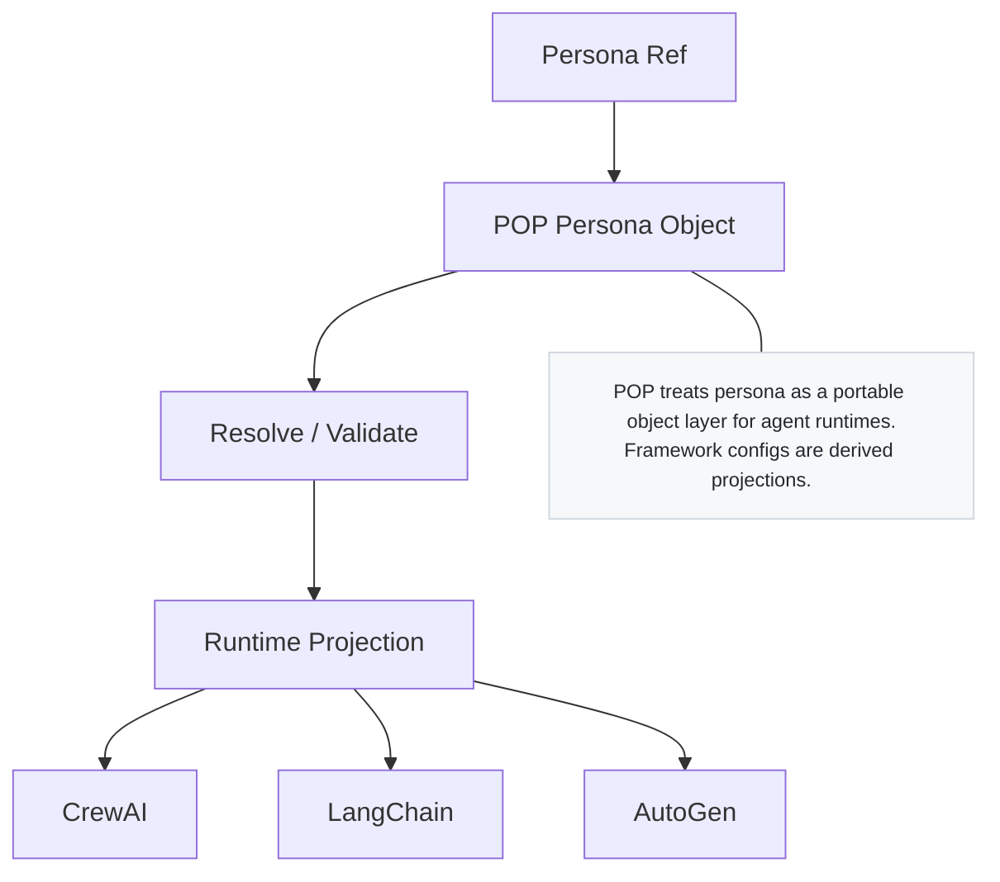

# POP Persona Layer Diagram

```mermaid
flowchart TD
    A[Persona Ref] --> B[POP Persona Object]
    B --> C[Resolve / Validate]
    C --> D[Runtime Projection]
    D --> E[CrewAI]
    D --> F[LangChain]
    D --> G[AutoGen]

    H[POP treats persona as a portable object layer for agent runtimes.<br/>Framework configs are derived projections.]:::note

    B --- H

    classDef note fill:#f6f8fa,stroke:#d0d7de,color:#24292f,font-size:12px;
```
